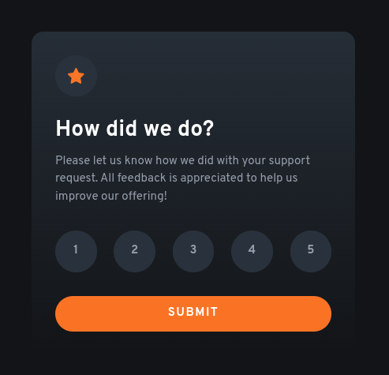

# Frontend Mentor - Interactive rating component solution

This is a solution to the [Interactive rating component challenge on Frontend Mentor](https://www.frontendmentor.io/challenges/interactive-rating-component-koxpeBUmI). Frontend Mentor challenges help you improve your coding skills by building realistic projects. 

## Table of contents

- [Overview](#overview)
  - [The challenge](#the-challenge)
  - [Screenshot](#screenshot)
  - [Links](#links)
- [My process](#my-process)
  - [Built with](#built-with)
  - [What I learned](#what-i-learned)
  - [Useful resources](#useful-resources)
- [Author](#author)
- [Acknowledgments](#acknowledgments)

## Overview

### The challenge

Users should be able to:

- View the optimal layout for the app depending on their device's screen size
- See hover states for all interactive elements on the page
- Select and submit a number rating
- See the "Thank you" card state after submitting a rating

### Screenshot

### Links

- Solution URL: [Solution page on Frontend Mentor](https://www.frontendmentor.io/solutions/tailwind-css-and-vanilla-js-solution--rfF4Iyw_l)
- Live Site URL: [GitHub Pages](https://danayatsuta.github.io/frontend-mentor-interactive-rating-component/)

## My process

### Built with

- Semantic HTML5 markup
- [Tailwind CSS](https://tailwindcss.com/) - CSS Framework
- Flexbox
- Mobile-first workflow
- JavaScript

### What I learned

- Basic JS for website interacivity
- Animations with Tailwind

### Useful resources

- ["JavaScript Crash Course" by Traversy Media](https://youtu.be/hdI2bqOjy3c)
- [Answer on Stack Overflow](https://stackoverflow.com/a/64001548) - this answer helped with making a fade-in animation work for element with "display: none" property

## Author

- Frontend Mentor - [@danaYatsuta](https://www.frontendmentor.io/profile/danaYatsuta)

## Acknowledgments

[Richard Hunter on Stack Overflow](https://stackoverflow.com/users/5481807/richard-hunter) - author of Stack Overflow answer mentioned above
